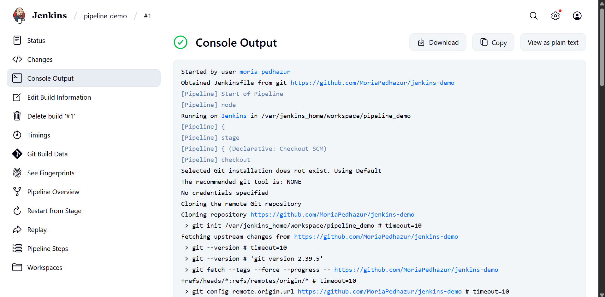
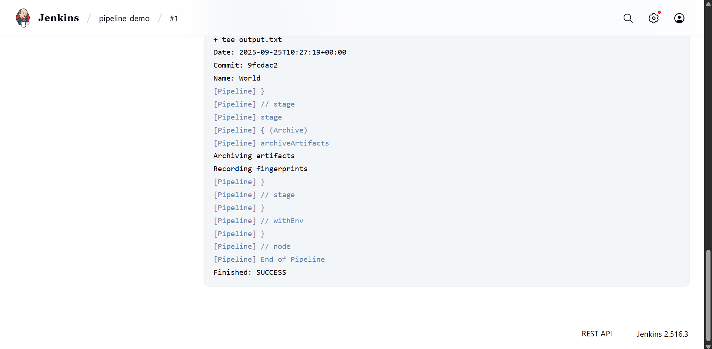
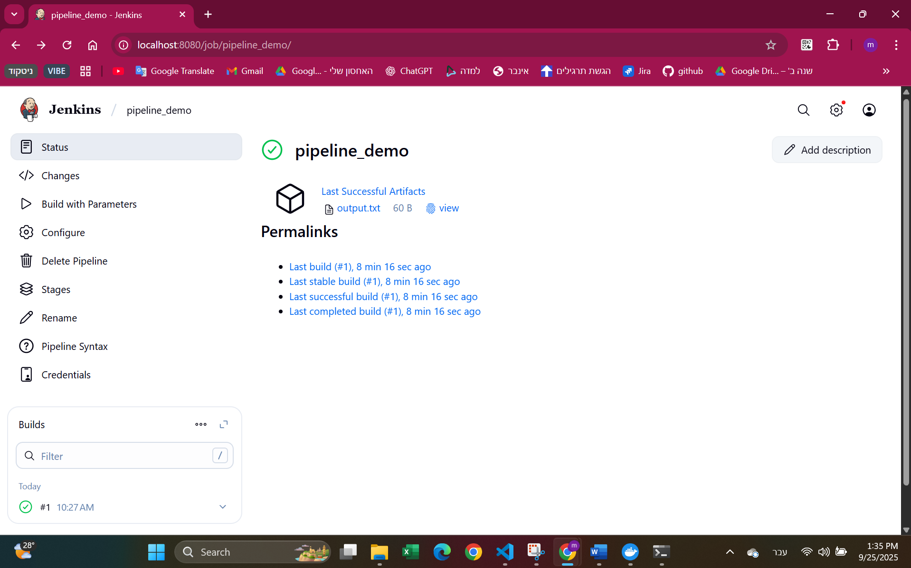
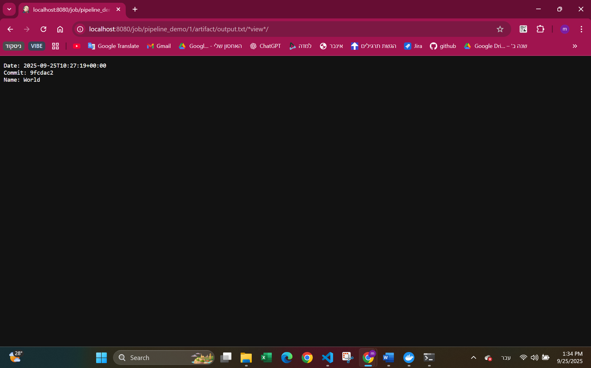

# Pipeline Demo

## 1. Repository URL
[https://github.com/MoriaPedhazur/jenkins-demo](https://github.com/MoriaPedhazur/jenkins-demo)

---

## 2. Docker Commands Used to Run Jenkins
```bash
# Step 1: Create persistent volume
docker volume create jenkins_home

# Step 2: Run Jenkins container with volume and port mapping
docker run -d --name jenkins -p 8080:8080 -v jenkins_home:/var/jenkins_home jenkins/jenkins:lts
```

- **`-d`**: run detached.
- **`--name jenkins`**: container name.
- **`-p 8080:8080`**: map Jenkins UI to http://localhost:8080.
- **`-v jenkins_home:/var/jenkins_home`**: mount persistent volume so Jenkins data survives restarts.

---

## 3. Credentials Handling (without secrets)
- The GitHub repository is public, so no credentials were required.
- If credentials were needed (for a private repository), they would be stored securely in Jenkins Credentials Manager and referenced in the job configuration.
- No secrets are stored in the Jenkinsfile or in source control.

---

## 4. Screenshots
- **Jenkins Build History with successful run**: 
<p align="center">
  
  
</p>

- **Archived artifact (output.txt)**: 
<p align="center">
  
  
</p>

---

## 5. Extra Explanation
### Task A – Jenkins on Docker
- Created named volume jenkins_home for persistent storage.
- Ran Jenkins container using the official jenkins/jenkins:lts image.
- Completed initial setup by retrieving the initial admin password:
  ```bash
  docker exec -it jenkins cat /var/jenkins_home/secrets/initialAdminPassword
  ```
- Created a non-default admin user.
- Verified persistence by stopping and starting the container (docker stop jenkins / docker start jenkins) and confirming settings remained.

### Task B – Bash Script and Jenkinsfile
- Added scripts/hello.sh with set -euo pipefail for safe execution.
- Marked the script executable (`chmod +x` and `git update-index --chmod=+x`).
- Created a Jenkinsfile with:
  - Parameter NAME (default: World).
  - Stages: Agent Info, Checkout, Run Script, Archive.
  - Output redirected to output.txt and archived as artifact.

### Task C – Pipeline in Jenkins
- Created new Pipeline job (`pipeline_demo`).
- Configured Pipeline script from SCM with GitHub repo URL, branch main, and script path Jenkinsfile.
- Ran first build successfully → output.txt created and archived.
- Enabled Poll SCM with schedule `H/2 * * * *` so Jenkins checks every 2 minutes for new commits.
- Verified that new commits trigger automatic builds.

---

## 6. Questions

**1. If you kill the Jenkins container, what command do you use to start it again with the same configuration?**
- If container exists but stopped:
  ```bash
  docker start jenkins
  ```
- If container was removed, re-run with the same volume:
  ```bash
  docker run -d --name jenkins -p 8080:8080 -v jenkins_home:/var/jenkins_home jenkins/jenkins:lts
  ```

**2. Explain briefly why Jenkins preserves its state after restart.**
- Jenkins preserves its state because its data directory `/var/jenkins_home` is mounted to a persistent Docker volume (`jenkins_home`).
- Data in volumes is stored on the host and not deleted when the container restarts or is recreated.
