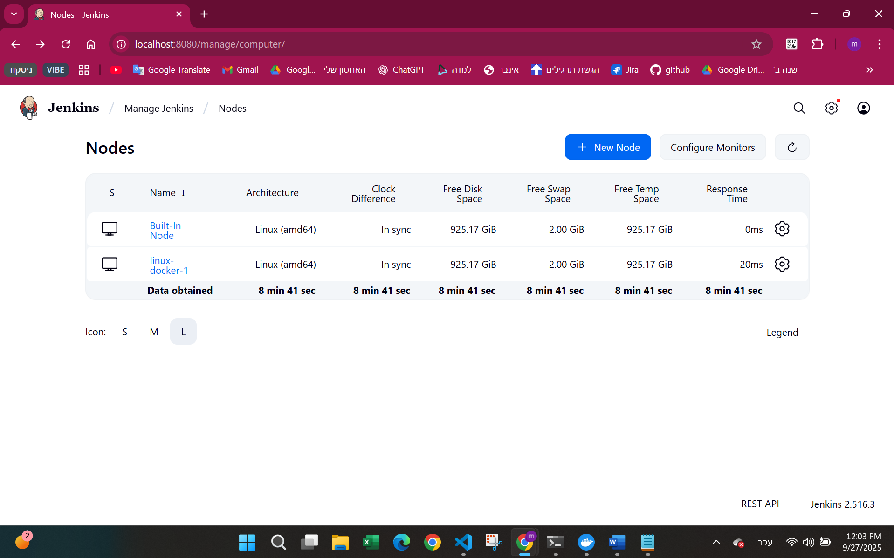
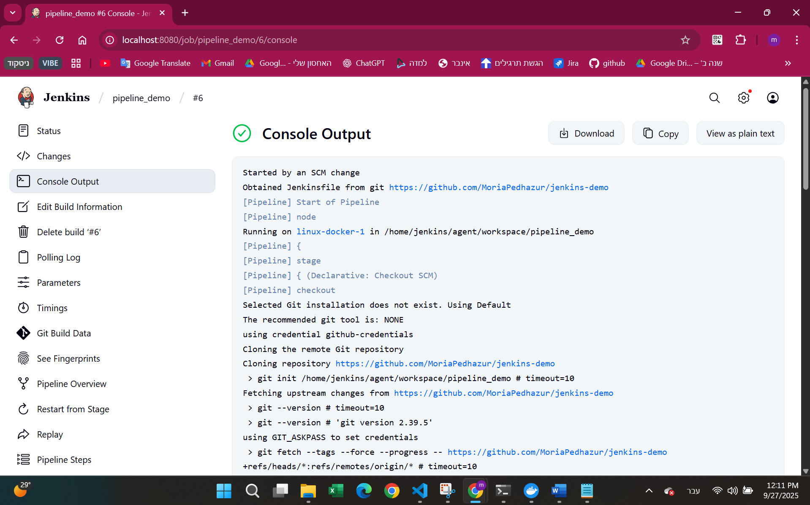
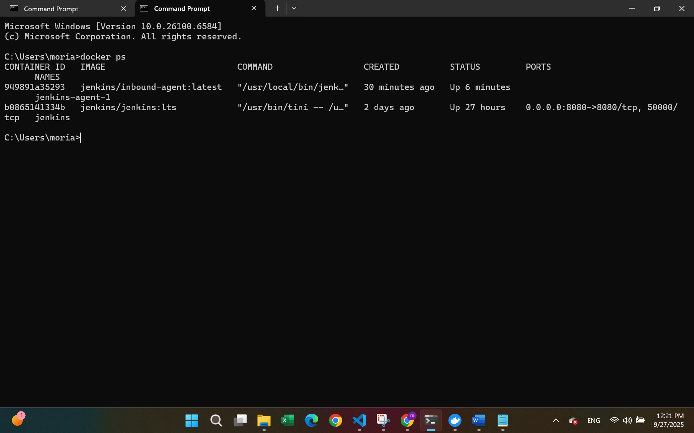

# Pipeline Demo

## 1. Repository URL
[https://github.com/MoriaPedhazur/jenkins-demo](https://github.com/MoriaPedhazur/jenkins-demo)

---

## 2. Docker Commands Used to Run Jenkins
```bash
# Step 1: Create persistent volume
docker volume create jenkins_home

# Step 2: Run Jenkins on port 8080 with a persistent volume for /var/jenkins_home
docker run -d --name jenkins -p 8080:8080 -v jenkins_home:/var/jenkins_home jenkins/jenkins:lts
```

---

## 3. Credentials Handling (without secrets)
- The repository started as private, so I created a GitHub Personal Access Token (PAT).
- The token was stored securely in Jenkins Credentials Manager and linked to the pipeline job.
- This allowed Jenkins to pull the private repo without exposing secrets in the Jenkinsfile.
- Before submission, the repository was made public, so credentials were no longer required.

---

## 4. Screenshots
- **Jenkins Build History with successful run**: 
<p align="center">
  
  
</p>

- **Archived artifact (output.txt)**: 
<p align="center">
  
  
</p>

---

## 5. Extra Explanation
### Task A – Run Jenkins in Docker
- Created named volume jenkins_home for persistent storage.
- Ran Jenkins container using the official jenkins/jenkins:lts image.
- Completed initial setup by retrieving the initial admin password:

  ```bash
  docker exec -it jenkins cat /var/jenkins_home/secrets/initialAdminPassword
  ```
- Created a non-default admin user.
- Verified persistence by stopping and starting the container (docker stop jenkins / docker start jenkins) and confirming settings remained.

### Task B – Prepare a Git Repository with a Script
- Added scripts/hello.sh with set -euo pipefail for safe execution.
- Marked the script executable (`chmod +x` and `git update-index --chmod=+x`).
- Created a Jenkinsfile with:
  - Parameter NAME (default: World).
  - Stages: Agent Info, Checkout, Run Script, Archive.
  - Output redirected to output.txt and archived as artifact.

### Task C – Create the Pipeline in Jenkins
- Created new Pipeline job (pipeline_demo).
- Configured Pipeline script from SCM with GitHub repo URL, branch main, and script path Jenkinsfile.
- Ran first build successfully → output.txt created and archived.
- Enabled Poll SCM with schedule `H/2 * * * *` so Jenkins checks every 2 minutes for new commits.
- Verified that new commits trigger automatic builds.

---

## 6. Questions

**1. If you kill the Jenkins container, what command do you use to start it again with the same configuration?**
- If container exists but stopped:
  ```bash
  docker start jenkins
  ```
- If container was removed, re-run with the same volume:
  ```bash
  docker run -d --name jenkins -p 8080:8080 -v jenkins_home:/var/jenkins_home jenkins/jenkins:lts
  ```

**2. Explain briefly why Jenkins preserves its state after restart.**
- Jenkins preserves its state because its data directory `/var/jenkins_home` is mounted to a persistent Docker volume (`jenkins_home`).
- Data in volumes is stored on the host and not deleted when the container restarts or is recreated.

---

## 7. Bonus – Provision a Dedicated Linux Agent in Docker

**What I did (in short):**
- Created a Docker network and connected the controller container to it.
- Added a Permanent Agent linux-docker-1 with label linux-docker-extra (Launch method: *Inbound*).
- Created a named volume jenkins_agent1 and mapped it to the agent workdir.
- Ran the official inbound agent with the required envs.
- Set the pipeline to `agent { label 'linux-docker-extra' }` -> job runs on this agent, output.txt archived, still works after `docker restart jenkins-agent-1`.

**Key commands:**
```bash
# Step 1: create a shared Docker network so containers can reach each other by name
docker network create jenkins-net

# Step 2: attach the Jenkins controller container to that network
docker network connect jenkins-net jenkins

# Step 3: Create persistent volume
docker volume create jenkins_agent1

# Step 4: Run the inbound Linux agent container
docker run -d --name jenkins-agent-1 --restart unless-stopped --network jenkins-net ^
  -e "JENKINS_URL=http://jenkins:8080/" -e "JENKINS_AGENT_NAME=linux-docker-1" ^
  -e "JENKINS_SECRET=<redacted>" -e "JENKINS_AGENT_WORKDIR=/home/jenkins/agent" ^
  -v jenkins_agent1:/home/jenkins/agent jenkins/inbound-agent:latest
```

**Screenshots:**

- **Node online + label** and **Pipeline runs on that node**  
<p align="center">
  
  
</p>

- **`docker ps` showing controller + agent running**  
<p align="center">
  
</p>
